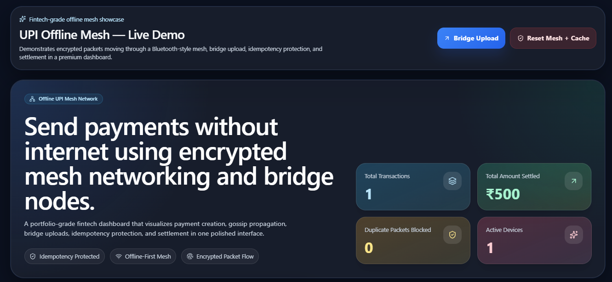
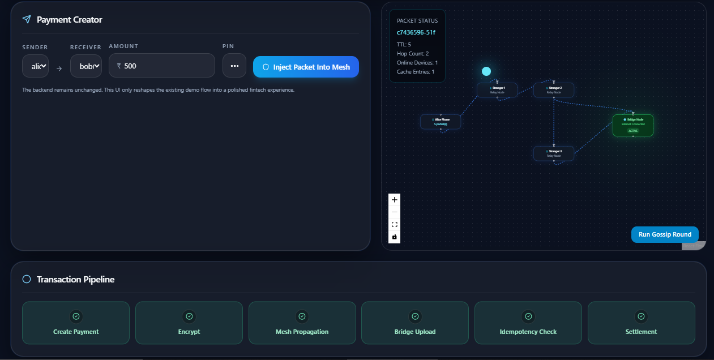
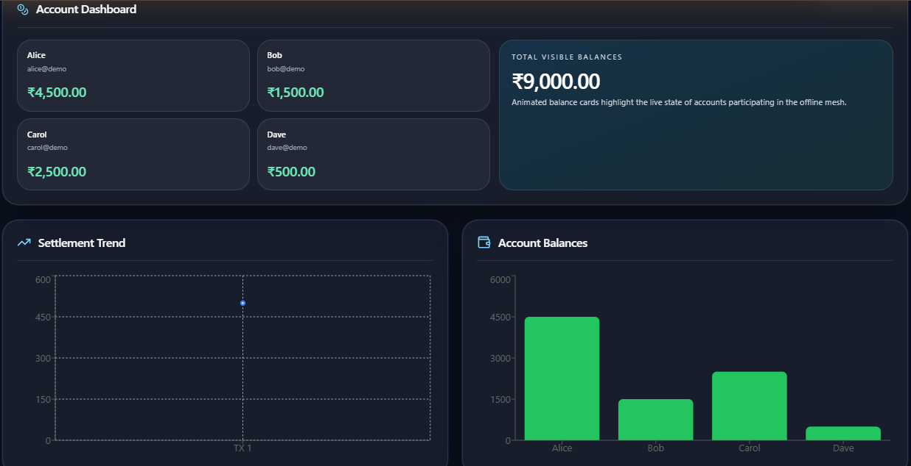
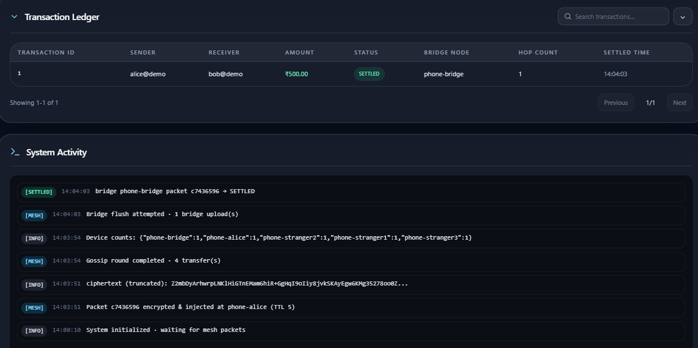
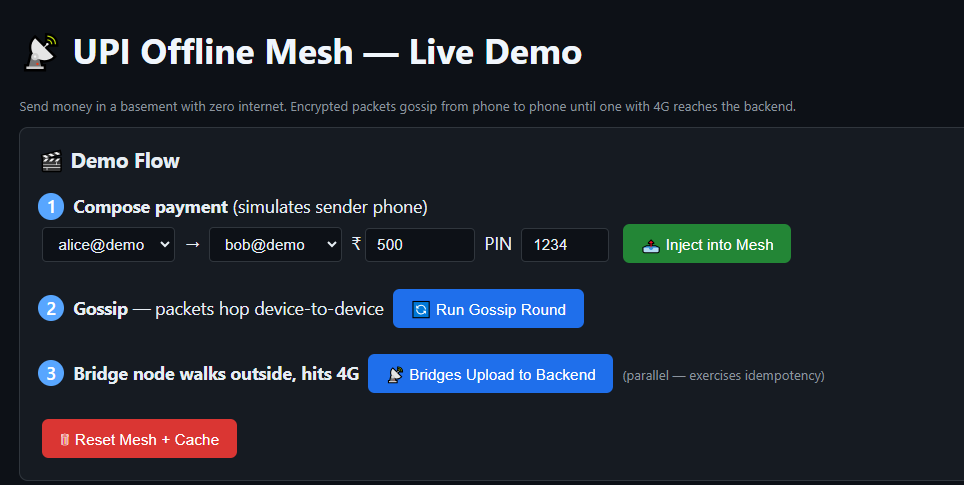
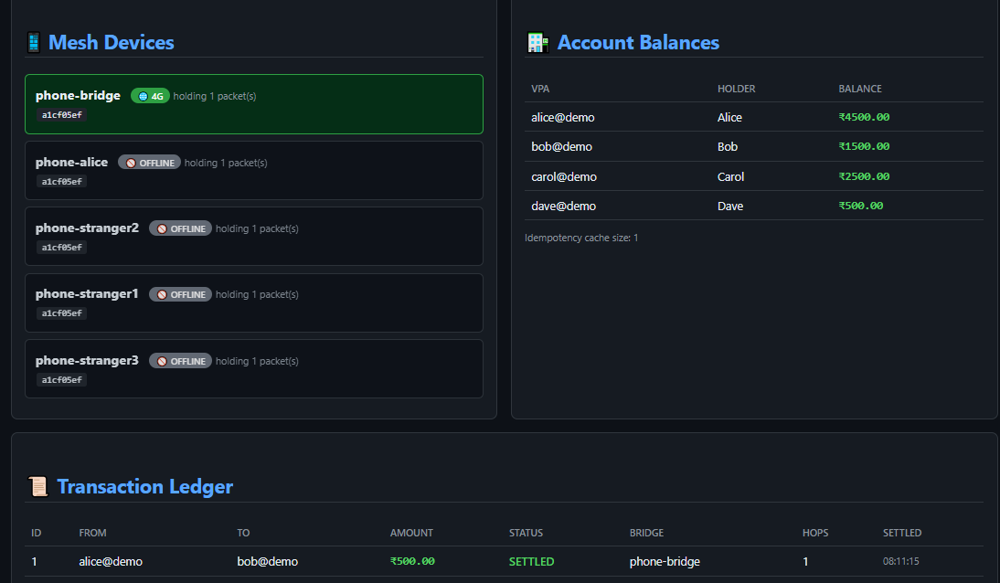

# Offline UPI Mesh Payment System

A full-stack fintech simulation that demonstrates how payment instructions can be securely routed through an offline mesh network and settled once a bridge node regains internet connectivity.

Built with **Spring Boot**, **React**, **TypeScript**, **Tailwind CSS**, **React Flow**, **React Query**, and **Framer Motion**.

---

## Overview

Traditional digital payments require an active internet connection. This project explores a different approach:

* A sender creates a payment while offline.
* The payment instruction is encrypted.
* The encrypted packet is propagated through nearby devices in a simulated Bluetooth-style mesh network.
* A bridge node eventually regains internet access.
* The bridge uploads the packet to the backend.
* An idempotency layer prevents duplicate settlement.
* The backend validates and settles the transaction.
* The transaction is recorded in the ledger.

This project demonstrates concepts from:

* Distributed Systems
* Network Routing
* Mesh Networking
* Cryptography
* Idempotent Transaction Processing
* Full-Stack Web Development

---

## Features

### Mesh Network Simulation

* Virtual devices participating in a mesh
* Packet gossip propagation
* Hop count tracking
* TTL (Time To Live) support
* Bridge node simulation

### Secure Payment Flow

* Encrypted payment packets
* Tamper-resistant payload handling
* Replay protection mechanisms
* Secure backend processing

### Idempotent Settlement Engine

* Duplicate packet detection
* Exactly-once settlement behavior
* Concurrency-safe processing
* Transaction ledger recording

### Modern Dashboard

* React + TypeScript frontend
* Tailwind CSS styling
* Framer Motion animations
* React Flow network visualization
* Recharts analytics dashboard
* Real-time activity logs
* Responsive design

---

## Tech Stack

### Frontend

* React
* TypeScript
* Vite
* Tailwind CSS
* Framer Motion
* React Query
* Axios
* React Flow
* Recharts
* Lucide React

### Backend

* Spring Boot
* Spring MVC
* Spring Data JPA
* Hibernate
* H2 Database

### Concepts Demonstrated

* Distributed Systems
* Offline-First Architecture
* Mesh Networking
* Cryptography
* Idempotency
* Concurrent Processing
* REST APIs

 ## Deployment:
- Docker
- Render
- Vercel

---

## Architecture

Sender Device
↓
Create Payment
↓
Encrypt Packet
↓
Inject Into Mesh
↓
Gossip Propagation
↓
Bridge Node
↓
Upload To Backend
↓
Idempotency Check
↓
Settlement Engine
↓
Transaction Ledger

---

## Dashboard Features

### Hero Dashboard

* Transaction KPIs
* Settlement metrics
* Active device monitoring

### Mesh Visualization

* Interactive network graph
* Device status indicators
* Packet movement simulation
* TTL and hop count tracking

### Transaction Pipeline

* Create Payment
* Encrypt
* Mesh Propagation
* Bridge Upload
* Idempotency Check
* Settlement

### Analytics

* Settlement Trend Chart
* Account Balance Distribution

### Ledger

* Searchable transactions
* Status badges
* Pagination support

### Activity Monitor

* Mesh events
* Settlement logs
* Duplicate packet detection
* System activity feed

---

## Live Demo

Frontend:
https://offline-upi-mesh-payment-system-kzs.vercel.app

Backend API:
https://offline-upi-mesh-payment-system-2.onrender.com

---

## Screenshot

## Dashboard



## Mesh Visualization



## Analytics



## Ledger



## Backend

 

 

---

## API Endpoints

| Method | Endpoint          | Description                 |
| ------ | ----------------- | --------------------------- |
| GET    | /api/accounts     | Retrieve account balances   |
| GET    | /api/transactions | Retrieve transaction ledger |
| GET    | /api/mesh/state   | Retrieve mesh state         |
| POST   | /api/demo/send    | Create payment packet       |
| POST   | /api/mesh/gossip  | Execute gossip round        |
| POST   | /api/mesh/flush   | Bridge upload simulation    |
| POST   | /api/mesh/reset   | Reset simulation            |

---

## Getting Started

### Prerequisites

* Java 17+
* Node.js 20+
* npm

### Run Backend

```bash
.\mvnw.cmd spring-boot:run
```

Backend URL:

```text
http://localhost:8080
```

### Run Frontend

```bash
cd frontend
npm install
npm run dev
```

Frontend URL:

```text
http://localhost:5173
```

---

## Build Frontend

```bash
cd frontend
npm run build
```

Production files will be generated in:

```text
frontend/dist
```

---

## Project Structure

```text
UPI_Without_Internet-main
│
├── frontend
│   ├── src
│   ├── components
│   ├── hooks
│   ├── lib
│   └── package.json
│
├── src/main/java
├── src/main/resources
├── pom.xml
└── README.md
```

---

## Future Improvements

* Real Bluetooth communication
* WebSocket live updates
* Redis-backed idempotency cache
* PostgreSQL persistence
* Multi-bridge simulation
* Authentication & authorization
* Docker deployment
* Cloud hosting

---

## Learning Outcomes

This project was built to explore:

* Offline payment architectures
* Distributed systems design
* Secure transaction processing
* Network propagation algorithms
* Modern React frontend engineering
* Spring Boot backend development

---

## Author

Harshad Chavhan

B.Tech – Artificial Intelligence & Data Science

Progressive Education Society's Modern College of Engineering, Pune

---

## License

MIT License

```
Copyright (c) 2026 Harshad Chavhan
```
